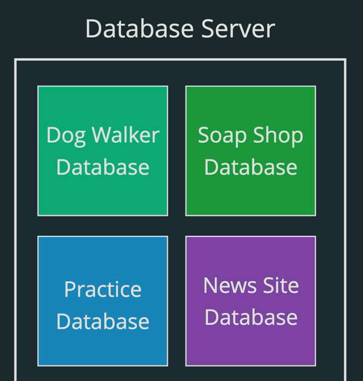

there is a couple of steps that we have to go through before we can work with real data . but this is an important piece of MySQL or any SQL database , so we've got our data base server , that's already installed in setup and within the world of database server , we can have a bunch of different databases . these are self contained , silos of data and tables and they have nothing to do with each other . 



to look at what databaese currently exist in database server , when you install mysql , there should be some default databases. 

`show databases;`

The `SHOW DATABASES` command is used in MySQL and other database management systems that support it, such as MariaDB, to list all databases that are managed by the server. This command is straightforward and provides a quick way to view all the databases available in your database server.

### Syntax

```sql
SHOW DATABASES;
```

### Usage

When you execute the `SHOW DATABASES` command, the server returns a list of all databases. The list includes the names of all databases that the user has the privilege to see.

### Example

```sql
SHOW DATABASES;
```

#### Output

The output might look something like this:

```
+--------------------+
| Database           |
+--------------------+
| information_schema |
| mysql              |
| performance_schema |
| sys                |
| your_database      |
+--------------------+
```

### Explanation of Output

- **information_schema**: A system database that contains metadata about other databases, such as table names, column names, and access privileges.
- **mysql**: A system database that contains information about user accounts and privileges.
- **performance_schema**: A system database that provides information about server performance.
- **sys**: A database introduced in MySQL 5.7, containing views, functions, and procedures for simplified database management.
- **your_database**: An example of a user-created database.

### Privileges

- The `SHOW DATABASES` command will only display the databases for which the user has at least some privileges. If the user has no privileges on a particular database, that database will not appear in the list.

<hr>


